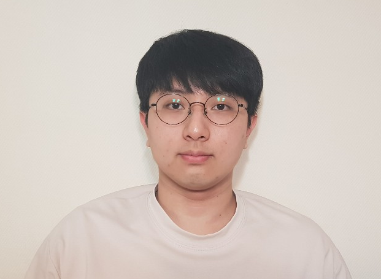

# 2021_1_resume

### 한림대학교 빅데이터 전공 이재성

-----

- __E-mail__
    - isl1@naver.com / isl121314@gmail.com

- __전화번호__
    - __010-4785-3727__

- __학력__
    - __강원고등학교 졸업__

    - __한림대학교 재학__ (2022년 2월 졸업 예정)
- github 주소
    - https://github.com/jaeseonglee

-------
## 자기 소개
저는 강원도 춘천시에 살고 한림대학교에 재학중인 이재성입니다.

|||
|-----|-----|
|나이| 25살|
|취미| 음악 감상, 야간 산책|
|병역| 육군 병장 만기 전역|
|종교| 무교|
|면허| 1종 보통 면허|
|||

### 지금까지 사용해본 프로그래밍 언어
- java
- `C` (가장 선호하는 프로그래밍 언어)
- C++
- C#
- python
- R
- HTML, CSS
- SQL

등이 있습니다.

### 교내 수상 경력
> SW WEEK GitHub 이력서 콘테스트 해커톤 동상
>> 당시 수상한 페이지
> - https://github.com/jaeseonglee/My_First_Resume

 

----------------------
## 대학교를 다니면서 배운 전공 과목과 Repository

### 2016년
|학년|학기|강의명|저장소|비고|
|----|----|----|----|----|
|1|1|유헬스기초프로그래밍1|https://github.com/jaeseonglee/1-1-Eclipse-File|java 프로그래밍|
|1|2|유헬스기초프로그래밍1|https://github.com/jaeseonglee/1-2-Eclipse-File|java 프로그래밍|
||||||

### 2019년
||||||
|----|----|----|----|----|
|2|1|C 프로그래밍|https://github.com/jaeseonglee/2-1-C|C |
|2|1|영상처리프로그래밍|https://github.com/jaeseonglee/2-1-Digital-Image-Processing|openCV와 C++ 사용 프로젝트|
|2|1|파이썬 과학 프로그래밍 기초|https://github.com/jaeseonglee/2-1-Python|python의 tkinter 사용 프로젝트|
|2|1|이산구조론|-|-|
|2|1|논리설계 및 실험|-|-|
||||||

||||||
|----|----|----|----|----|
|2|2|C++ 프로그래밍|https://github.com/jaeseonglee/2-2-Cpp|C++|
|2|2|자료구조|https://github.com/jaeseonglee/2-2-Data-Structure|java 실습을 통한 자료구조 강의|
|2|2|데이터베이스|-|-|
|2|2|컴퓨터구조|-|-|
|2|2|소프트웨어세미나|-|-|
||||||

### 2020년
||||||
|----|----|----|----|----|
|3|1|윈도우 프로그래밍|https://github.com/jaeseonglee/3-1-Csharp|C#| 
|3|1|멀티미디어개론|https://github.com/jaeseonglee/3_1_MultiMedia|멀티미디어개론|
|3|1|운영체제|-|-|
|3|1|소프트웨어공학|-|-|
|3|1|정보보호론|-|-|
|3|1|소프트웨어개론|-|-|
|3|1|프로그래밍어론|-|-|
||||||

||||||
|----|----|----|----|----|
|3|2|클라우드 컴퓨팅|https://github.com/jaeseonglee/Cloud_Computing_Term_Project|python과 AWS를 사용한 팀 프로젝트|
|3|2|오픈소스 SW 개발도구 및 활용|https://github.com/jaeseonglee/My_First_Resume|이 강의를 통해 마크다운 언어 지식 습득|
|3|2|알고리즘|https://github.com/jaeseonglee/3_2_Algorithm|java 실습을 통한 알고리즘 강의|
|3|2|텍스트 정보처리|https://github.com/jaeseonglee/3_2_Text-Infomation-Programming|python 실습을 colab에서 진행한 강의|
|3|2|빅데이터개론|-|저장소는 당시 사용하던 csv 파일들을 등록|
|3|2|시스템 프로그래밍|-|리눅스 OS에서 C 실습을 통한 강의|
|3|2|임베디드 시스템|-|-|
|3|2|임베디드 시스템|-|-|
|3|2||-|-|
||||||

### 2021년
||||||
|----|----|----|----|----|
|4|1|빅데이터 캡스톤 디자인|https://github.com/jaeseonglee/BigData_Capstone_Design|졸업 필수 강의|
|4|1|웹 프로그래밍|https://github.com/jaeseonglee/4_1_Web_Programming|HTML,css,js를 배우는 중|
|4|1|인공지능|-|-|
|4|1|데이터베이스 시스템|-|-|
|4|1|소프트웨어특강1|-|-|
||||||

앞으로도 제 SW 역량을 키우기 위해 노력하고 열심히 하겠습니다.
감사합니다.